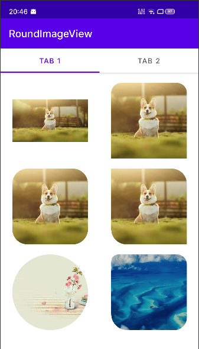
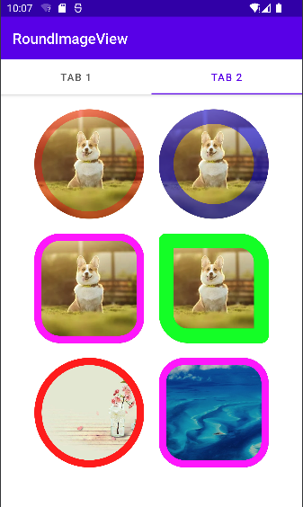

# RoundImageView

  [](https://android-arsenal.com/api?level=18)  [](https://github.com/WeiLianYang/GradientTextView/blob/master/LICENSE)

### 🔥🔥🔥用于设置 ImageView 的 *圆角*、*外边框颜色*、*外边框宽度*

### 添加依赖

```groovy
buildscript {
    repositories {
        mavenCentral()
    }
}

implementation 'io.github.weilianyang:RoundImageView:1.0.0'
```

### 效果预览：

 

### 一、控件样式

```xml
<declare-styleable name="RoundImageView">

    <!-- 圆角大小，如果只设置了此值，则默认会使用其作为所有圆角的值 -->
    <attr name="riv_radius" format="dimension" />

    <!-- 顶部左侧圆角大小 -->
    <attr name="riv_topLeft_radius" format="dimension" />

    <!-- 顶部右侧圆角大小 -->
    <attr name="riv_topRight_radius" format="dimension" />

    <!-- 底部左侧圆角大小 -->
    <attr name="riv_bottomLeft_radius" format="dimension" />

    <!-- 底部右侧圆角大小 -->
    <attr name="riv_bottomRight_radius" format="dimension" />

    <!-- 作为圆形图片，和 riv_radius 一起使用。
         如果未设置 riv_radius，半径将取宽高最小值的一半 -->
    <attr name="riv_roundAsCircle" format="boolean" />

    <!-- 外边框颜色 -->
    <attr name="riv_borderColor" format="color" />

    <!-- 外边框宽度 -->
    <attr name="riv_borderWidth" format="dimension" />

</declare-styleable>
```

### 二、属性介绍

| 属性                     | 值             | 说明                                                     |
|:-----------------------|:--------------|:-------------------------------------------------------|
| riv_radius             | 单位dp          | 圆角大小，如果只设置了此值，则默认会使用其作为所有圆角的值                          |
| riv_topLeft_radius     | 单位dp          | 顶部左侧圆角大小                                               |
| riv_topRight_radius    | 单位dp          | 顶部右侧圆角大小                                               |
| riv_bottomLeft_radius  | 单位dp          | 底部左侧圆角大小                                               |
| riv_bottomRight_radius | 单位dp          | 底部右侧圆角大小                                               |
| riv_roundAsCircle      | true or false | 作为圆形图片，和 riv_radius 一起使用。如果未设置 riv_radius，半径将取宽高最小值的一半 |
| riv_borderColor        | 颜色值           | 外边框颜色                                                  |
| riv_borderWidth        | 单位dp          | 外边框宽度                                                  |

### 三、在 xml 中使用

#### 1. 分别指定4个圆角的大小
```xml

<com.william.widget.RoundImageView
    android:layout_width="150dp"
    android:layout_height="150dp"
    android:scaleType="centerCrop"
    app:riv_bottomLeft_radius="32dp"
    app:riv_bottomRight_radius="25dp"
    app:riv_topLeft_radius="14dp"
    app:riv_topRight_radius="20dp" />

```


#### 2. 作为圆形图片使用
```xml

<com.william.widget.RoundImageView
    android:layout_width="150dp"
    android:layout_height="150dp"
    android:scaleType="centerCrop"
    app:riv_roundAsCircle="true" />

```


#### 3. 设置外边框宽度和颜色
```xml

<com.william.widget.RoundImageView
    android:layout_width="150dp"
    android:layout_height="150dp"
    android:scaleType="centerCrop"
    app:riv_borderColor="#ff00ff"
    app:riv_borderWidth="5dp"
    app:riv_radius="1dp" />

```
